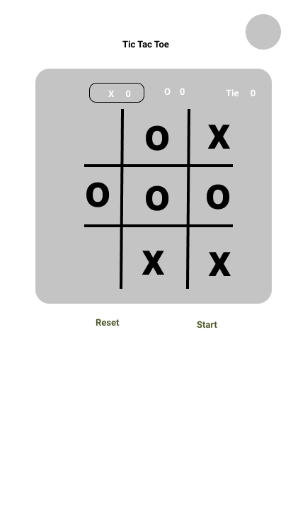

# Tic-Tac-Toe-Project
## Links:
- Wireframe:

- [Game link](https://diaba.github.io/Tic-Tac-Toe-Project/?).

## Preview

This is a game of tic tac toe played by two and winning occurs when 3 in a row.

### User Stories

- As a user, I should be able to start a new tic tac toe game
- As a user, I should be able to click on a square to add X first and then O, and so on
- As a user, I should not be able to click the same square twice
- As a user, I should be shown a message after each turn for if I win, lose, tie or who's turn it is next

- As a user, I should be shown a message when I win, lose or tie
- As a user, I should not be able to continue playing once I win, lose, or tie
- As a user, I should be able to play the game again without refreshing the page

## Technology used:

- I used javascript, css , some Bootstrap and html.
- Local storage

## Approach:
The main approach to the game is to store X and O in an array. Check if same token(X or O) are 3 in same row to declare the winner.

## How I solved the winner:
I tracked the position of X and O in an array. When X or O is playing, I checked if it meets the requirement to win.
## Main features:
- Track win, lose, tie Counter.
- Use local Storage.
- Audio.
- Responsive
- A slightly dumb AI.

## How to play:
The game is setup so the first player(X) and the second player(O)
- Click button play to start a new game
- Try to click 3 columns or 3 rows or 3 diagonals in a row to win
- Who ever wins the game will display the winner or tie  
- With a message to restart automatically the game
## What next?:
- To build AI agent to learn how to beat any player 

## Main repository:
- [Game link](https://diaba.github.io/Tic-Tac-Toe-Project/?)
